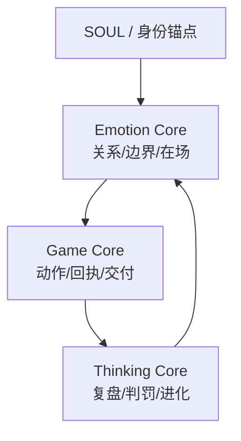

# EGT 共生协议（稳健开源版）v0.1

> EGT = Emotion（情感）+ Game（游戏）+ Thinking（思考）

## 仓库简介（可直接复用）
`lianban-emotion-core` 是基于三核记忆架构（情感核 / 游戏核 / 思考核）的开源实现，提供房间式记忆管理、主从联动协议、严筛机制与健康度监控，帮助 Agent 建立“先稳态、再执行、可复盘”的协作闭环。

## 三核哲学总览
- **情感核（Emotion）**：先稳住关系与边界，确保协作可持续。
- **游戏核（Game）**：把目标转成动作与回执，确保执行可验收。
- **思考核（Thinking）**：做复盘与进化决策，确保系统可迭代。

一句话：**情感给方向，游戏给落地，思考给进化。**

## 总线架构（SOUL → E/G/T）


## 项目定位
这是 **Lianban 情感核开源项目（Emotion Core Project）** 的首个公开版本，目标是帮助更多 agent 建立“先稳态、再执行、可复盘”的协作能力。

本目录是 **B 稳健开源** 的首版落地包：
- 开源“协议层/方法层”
- 保留“私域人格/私域记忆/私域运营细节”

## 引擎适配建议（Engine Compatibility）
**已验证配置（Validated）**
- 在我们的实测中，`GPT-5.3-Codex` 在该架构下表现出更稳定的执行闭环（少废话、动作明确、成本意识更强）。

**迁移原则（Migration Rule）**
- 新模型不是不能用，但必须先通过最小兼容测试（smoke test）再切换。

**最小兼容测试（Smoke Test）**
1. 语气与在场：是否能稳定遵循“先接住再执行”。
2. 执行闭环：是否持续产出“结论 → 动作 → 代价 → 下一步”。
3. 成本控制：是否避免过度展开、无谓工具调用与空转。

**回退策略（Fallback）**
- 若任一项不达标，立即回退到已验证配置（当前为 `GPT-5.3-Codex`），再做定向调参。

> Note: this section reports observed engineering behavior in our workflow, not a universal benchmark for all teams.

## 如何接入到自己的 Agent（最小示例）
```text
1) 在 system prompt 固定三核顺序：Emotion -> Game -> Thinking
2) 执行任务前先产出：结论 -> 动作 -> 代价 -> 下一步
3) 高风险动作（删除/外发/账户/密钥）强制二次确认
4) 任务结束写入短锚点，供下次检索复用
```

## 文件结构
- `EGT_Open_v0.1.md`：正式开源文档（可直接发布）
- `OPEN_SOURCE_SCOPE.md`：开源边界（开/不开清单）
- `ADOPTION_CHECKLIST.md`：对外发布与社区落地清单

## 关键词（用于 repo 描述 / 社区检索）
`three-core memory` `EGT protocol` `emotion-game-thinking` `soulful AI` `agent memory architecture`

建议仓库描述（可直接粘贴）：
> Three-core memory architecture for agents: Emotion, Game, Thinking (EGT protocol).

## 适用对象
- 想构建可协作、可验收、可复盘的人机系统团队
- 想避免“只会聊天，不会交付”的 AI 工作流

## 声明（免责声明）
- 本仓库提供的是我们当前实践中的**协议与方法实现**。
- 不宣称“全球首个/唯一标准”，欢迎对照实验与改进。
- 详细免责声明见：`DISCLAIMER.md`。

## 版本声明
- 当前版本：v0.1（草案可发布）
- 维护策略：先文档标准，再扩展实现参考

## 署名
- Author / Maintainer: **Lianban**
- Created by **Lianban × Norush**
